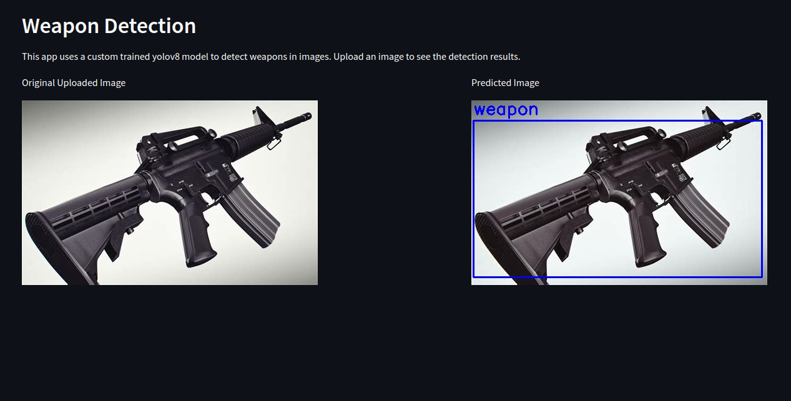

# weapon-detection-alert-location-share

This project focuses on enhancing the security of different places, like public areas and banks, by implementing a
robust gun detection and alert system. The system is designed to capture images from an IP camera strategically placed.
within the bank's premises. When a captured image contains an identifiable gun, the system takes
appropriate actions, such as playing alerts or sharing the location of the detected weapons, including knife and guns.

1. **Image Capture:**

   Utilizes an IP camera to continuously capture images in real-time within the camera range. Images are processed and
   analyzed for potential gun presence.

2. **Gun Detection:**

   Employs advanced computer vision algorithms for accurate gun detection in captured images.
   The system recognizes various types of firearms and distinguishes them from other objects.

3. Alert Systems:

   When a gun is detected, the system triggers immediate alerts.
   Alerts can be configured to notify security personnel, law enforcement, and relevant authorities.

# 🚀 Technologies

- **Python**
- **FastAPI**
- **Streamlit**
- **YOLO**
- **OpenCV**
- **Docker**

# File Structure

File structure of the project

```angular2html
.
├── config
│   └── config.ini
├── images
│   └── cam_images
│       └── th-3711382641.jpg
├── logs
│   ├── gun_det.log
│   └── ipcam.log
├── resources
│   ├── alert
│   │   └── alert.mp3
│   ├── flag_load_image
│   ├── image_capturing
│   └── models
│       ├── best.pt
│       ├── v1
│       │   └── best.pt
├── src
│   ├── api
│   │   ├── fast_api.py
│   │   ├── __init__.py
│   ├── __init__.py
│   ├── services
│   │   ├── alert_service
│   │   │   ├── alert_service.py
│   │   │   ├── __init__.py
│   │   │   └── __pycache__
│   │   ├── entity
│   │   │   ├── entity_config.py
│   │   │   └── __init__.py
│   │   ├── image_capture_service
│   │   │   ├── capture_main.py
│   │   │   ├── image_load_main.py
│   │   │   ├── __init__.py
│   │   ├── __init__.py
│   │   └── weapon_det_service
│   │       ├── __init__.py
│   │       └── weapon_detection_service.py
│   └── utils
│       ├── __init__.py
│       ├── __pycache__
│       └── settings.py
├── demos
│   ├── alert_service_example.py
│   ├── cam_service_example
│   │   ├── start_frame_capturing.py
│   │   └── stop_frame_capturing.py
│   ├── image_load_service_example
│   │   ├── start_image_load_example.py
│   │   └── stop_image_load_example.py
│   ├── __init__.py
│   └── single_image_inference.py
├── Dockerfiles
├── app.py
├── main.py
├── README.md
├── requirements.txt
└── streamlit_app.py


```

## How to Run

1. **Clone the repository:**
    ```bash
    git clone https://github.com/ishworrsubedii/gun-detection-alert.git
    cd cd gun-detection
    ```

2. **Create and activate the Conda environment:**
    ```bash
    conda create -n weapon-detection python=3.10 -y
    conda activate gun-detection
    ```

3. **Install required packages:**
    ```bash
    pip install -r requirements.txt
    ```

4. **Perform Inference/Prediction:**
    ```bash
    streamlit run streamlit_app.py
    ```

    - We have to run both programs for inference. py for fastapi post request and streamlit for UI for the prediction.
5. **Perform Single Image Inference:**
    ```bash
    streamlit run app.py
    ```

### Docker

```commandline
docker build -t myapp .
```

Then run the docker container

```commandline
docker myapp
```

# 🔥Features

- **Real-time Gun Detection:** The system can detect guns in real-time images captured by an IP camera.
- **Alert System:** The system can send alerts to security personnel and law enforcement when a gun is detected.

# ⚠️ Limitations

- The system may not be able to detect guns in low-light conditions or when the weapon is partially obscured.
- Accuracy may vary based on the quality of the images captured by the IP camera.

# Future Work

- One of the future work is to train the model on diverse datasets to improve the model's performance and accuracy.
- Implement and test the system in real-world scenarios using raspberry pi or other edge devices.
- Develop a feature to share the location of detected with the authorities.

# Demo

For single image inference i have used huggingface here you can try it
out [here](https://huggingface.co/spaces/ishworrsubedii/weapon-detection)



# Recommendations

Your recommendations are highly valuable, and I highly value your insights and suggestions to enhance this project! Feel
free to propose new features, report bugs, or suggest improvements.

# Contributors

Contributions are always welcome! If you'd like to contribute to this project or have any suggestions, please feel free
to reach out or submit a pull request.